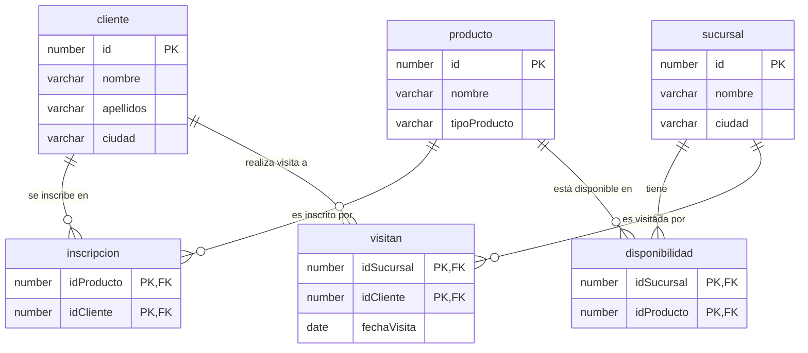

# **Prueba Técnica – Ingeniero de Desarrollo Back End**

Fecha: 20/06/2025

Empresa: AMY

## **Parte 1 – Fondos (80%)**

### **Necesidad de negocio:**

YAM desea crear una plataforma que permita a los clientes gestionar sus fondos de inversión sin necesidad de contactar a un asesor. Las funcionalidades requeridas son:

### **Funcionalidades del sistema:**

1. Suscribirse a un nuevo fondo (apertura).

2. Cancelar la suscripción a un fondo actual.

3. Ver historial de transacciones (aperturas y cancelaciones).

4. Enviar notificación por email o SMS según preferencia del usuario al suscribirse a un fondo.

### **Reglas de negocio:**

Monto inicial del cliente: COP $500.000.

Cada transacción debe tener un identificador único.

Cada fondo tiene un monto mínimo de vinculación.

Al cancelar una suscripción, el valor de vinculación se retorna al cliente.

Si no hay saldo suficiente, mostrar:

“No tiene saldo disponible para vincularse al fondo <Nombre del fondo>”

### **Información de los fondos:**

|ID|Nombre|Monto mínimo|Categoría|
|---|---|---|---|
|1|FPV_ AM_PACTUAL_RECAUDADORA Y |COP $75.000|FPV|
|2|FPV_ AM_PACTUAL_ECOPETROL Y|COP $125.000|FPV|
|3|DEUDAPRIVADA|COP $50.000|FIC|
|4|FDO-ACCIONES|COP $250.000|FIC|
|5|FPV_ AM_PACTUAL_DINAMICA Y|COP $100.000|FPV|

Internal Use Only

### **Actividades solicitadas:**

1. Tecnologías sugeridas: Python con FastAPI, .NET Core, Java Springboot o Express - Node.js

2. Diseñar un modelo de datos NoSQL que soporte las operaciones.

3. Construir una API REST que implemente las funcionalidades descritas.

4. Incluir:

- Manejo de excepciones.

- Código limpio (Clean Code).

- Pruebas unitarias.

- Buenas prácticas de seguridad y mantenibilidad.

5. Despliegue: El backend debe poder desplegarse mediante AWS CloudFormation, con documentación incluida.

## **Parte 2 – SQL (20%)**

### **Base de datos: YAM**

Escriba las consultas SQL correspondientes, para ello, tenga en cuenta la base de datos llamada “YAM” la cual tiene las siguientes tablas (tenga en cuenta que se puede presentar el caso de que no todas las sucursales ofrecen los mismos productos).

Tablas disponibles:

Cliente (id, nombre, apellidos, ciudad)

Sucursal (id, nombre, ciudad)

Producto (id, nombre, tipoProducto)

Inscripción (idProducto, idCliente)

Disponibilidad (idSucursal, idProducto)

Visitan (idSucursal, idCliente, fechaVisita)

# Diagrama de Base de Datos

A continuación se detalla la estructura de la base de datos basada en la imagen proporcionada. Se incluyen las tablas en formato Markdown y un diagrama generado con sintaxis Mermaid.

## Tablas

### `cliente`
| Restricción | Columna | Tipo |
| :--- | :--- | :--- |
| PK | id | number |
| NN | nombre | varchar |
| NN | apellidos | varchar |
| NN | ciudad | varchar |

### `producto`
| Restricción | Columna | Tipo |
| :--- | :--- | :--- |
| PK | id | number |
| NN | nombre | varchar |
| NN | tipoProducto | varchar |

### `sucursal`
| Restricción | Columna | Tipo |
| :--- | :--- | :--- |
| PK | id | number |
| NN | nombre | varchar |
| NN | ciudad | varchar |

### `inscripcion`
| Restricción | Columna | Tipo |
| :--- | :--- | :--- |
| PK, FK (producto.id) | idProducto | number |
| PK, FK (cliente.id) | idCliente | number |

### `disponibilidad`
| Restricción | Columna | Tipo |
| :--- | :--- | :--- |
| PK, FK (sucursal.id) | idSucursal | number |
| PK, FK (producto.id) | idProducto | number |

### `visitan`
| Restricción | Columna | Tipo |
| :--- | :--- | :--- |
| PK, FK (sucursal.id) | idSucursal | number |
| PK, FK (cliente.id) | idCliente | number |
| NN | fechaVisita | date |

---

## Diagrama Entidad-Relación

## Consulta solicitada
Obtener los nombres de los clientes que tienen inscrito algún producto disponible solo en
las sucursales que visitan.

